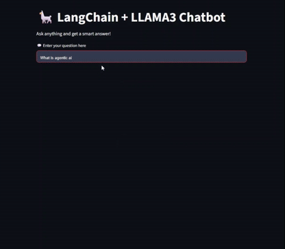

# 🦙 LangChain + LLAMA3 Chatbot Demo

This is a simple and interactive chatbot demo built using:

> _Ask natural language questions and get intelligent answers from a local LLM running via Ollama!_

---

## 🚀 Features

- 🌐 Uses **LLAMA3** (via Ollama) as the local language model
- ⚙️ Powered by **LangChain** for prompt management and chaining
- 💬 Clean and responsive **Streamlit UI**
- 🧠 **LangSmith** integration for LLM tracing and observability

---

## 📸 Demo

  

